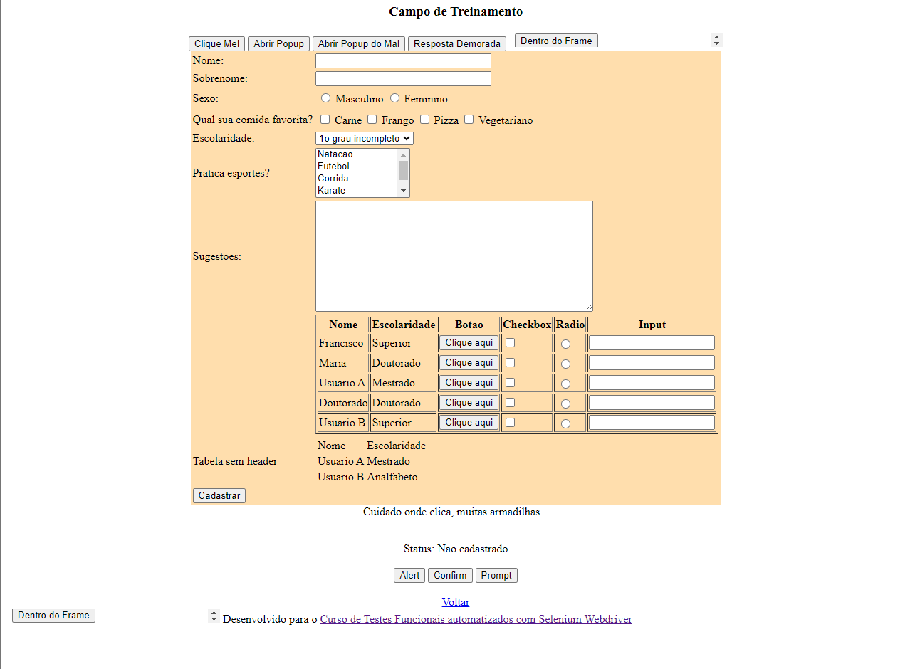

# Automação Simples Para Sistemas Web

Este repositório tem o objetivo de mostrar que criar automações para sistemas web podem ser bastante simples e funcionais.

O projeto se trata de um Projeto Java Maven contendo as dependências do Selenium, JUnit e Commons-io para realizar escrever testes automatizados.

